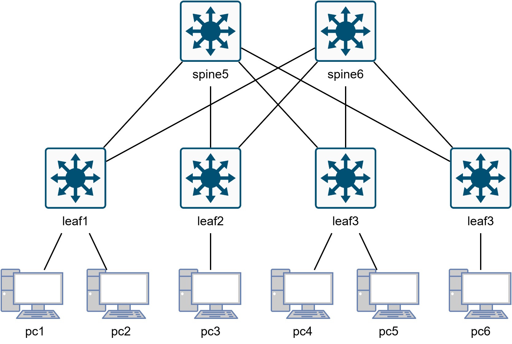

# SDN Reactive Firewall: DoS Detection & Mitigation (Ryu + Snort IDS)

This project implements a reactive firewall mechanism within a SDN environment. It integrates the **Ryu Controller** with **Snort IDS** to automatically detect DoS attacks and block malicious traffic at the switch level in real-time.

## 🔄 Workflow

The system operates in a closed loop:
1.  Network traffic is mirrored to Snort.
2.  Snort analyzes packets against IDS rules.
3.  Upon detecting an attack, Snort alerts the Ryu controller, which dynamically pushes OpenFlow rules to drop the malicious traffic at the source.

## 🌐 Network Topology

The simulation runs in **Mininet** using a **Leaf-Spine** architecture:

  

## ⚙️ Usage

### Prerequisites
* Linux Ubuntu 22.04
* Python 3.10.12
* Mininet 2.3.1b4
* Ryu Controllerr 4.34
* Snort
