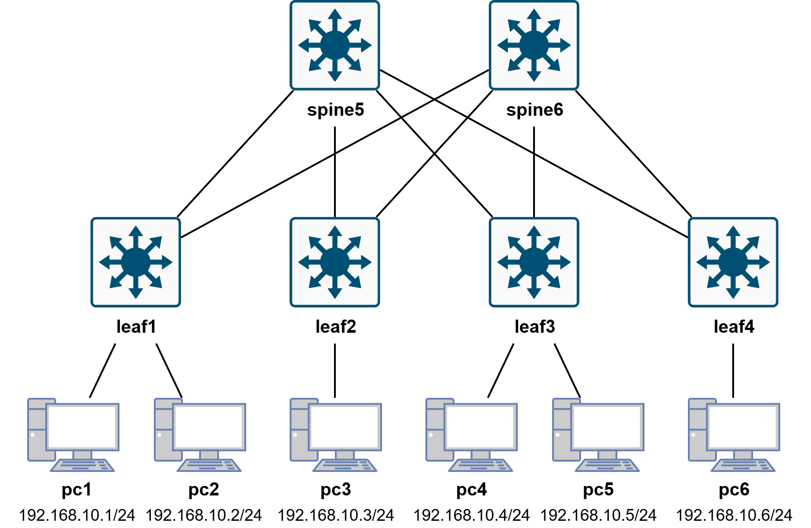

# SDN Reactive Firewall: DoS Detection & Mitigation (Ryu + Snort IDS)

This project implements a reactive firewall mechanism within a SDN environment. It integrates the **Ryu Controller** with **Snort IDS** to automatically detect DoS attacks (specifically TCP SYN Flood) and block malicious traffic at the switch level in real-time.

## 🔄 Workflow

The system operates in a closed loop:
1.  Packet mirroring ports are created on Leaf switches. Every packet reaching a destination is efficiently copied in parallel to the Snort instance.
2.  Snort analyzes packet headers and payloads based on defined IDS rules.
3.  Upon detecting an attack (e.g., SYN Flood), Snort generates an alert containing the source and destination IP/MAC addresses. Due to the `-A unsock` configuration, this alert is sent directly to the Ryu controller.
4.  The `ryu_firewall.py` app receives the alert, parses it, and identifies the attacker's source IP.
5.  Ryu creates an OpenFlow rule with high priority `(priority=100)` that instructs the switch to drop all packets coming from the detected source IP.
6.  The drop rule is pushed to all switches, effectively cutting off the attacker from the network for the duration of the idle_timeout (300s).

## 🌐 Network Topology

The simulation runs in **Mininet** using a **Leaf-Spine** architecture:
<p align="center">
  
</p>

- **Endpoints**: 6 PCs
- **Switches**: 6 OpenFlow switches
- **Link Bandwidrh**: 10 Mbps

## ⚙️ Tools

* Linux Ubuntu 22.04
* Python 3.10.12
* Mininet 2.3.1b4
* Ryu Controllerr 4.34
* Snort 2.9.15.1
* hping3
* iperf

## 🚀 Environment Setup
#### 1. Start the Ryu controller (only with Python 3.9)
First, launch the controller to listen for incoming switch connections, initialize the control plane, configure STP via the Ryu framework, and open the socket for receiving Snort alerts.
```bash
ryu run ryu_firewall.py
```
#### 2. Start the network simulation
Next, build the topology. This script will configure the switches and connect them to the running controller. After 30 seconds, traffic generation begins. 
```bash
sudo python3 simulate_network.py
```
#### 3. Start Snort
Once Mininet has created the virtual interfaces, launch Snort to begin listening on the mirror ports.
```bash
sudo python3 run_snort.py
```

## 📚 References
1. Analysis and Review of TCP SYN Flood Attack on Network with Its Detection and Performance Metrics - Hrishikesh Shriram Salunkhe, Prof. Sanjay Jadhav, Prof. Vijay Bhosale. International Journal of Engineering Research & Technology (IJERT). 2017
2. SDN-Based Intrusion Detection System for Early Detection and Mitigation of DDoS Attacks - Pedro Manso, José Moura, Carlos Serrão. 2019
3. https://ianpeter.medium.com/denial-of-service-dos-attack-and-detection-using-snort-90ae68667822

## 🛟 Support
Ryu official site: https://ryu.readthedocs.io/en/latest/index.html \
Snort documentation: https://www.snort.org/ \
Mininet documentation: http://mininet.org/
